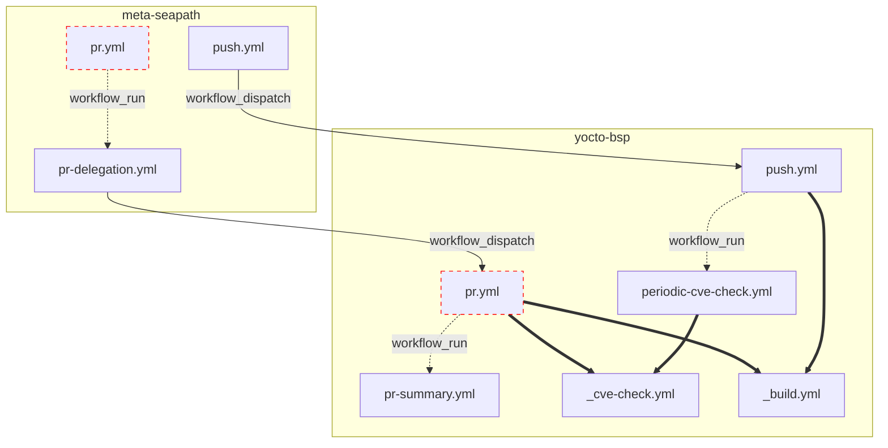

# CI/CD documentation

```mermaid
flowchart TD
    classDef unpriviledged stroke:red,stroke-dasharray:5;

   subgraph yocto-bsp
        push-bsp[push.yml]
        pr-bsp[pr.yml]:::unpriviledged

        pr-summary.yml
        periodic-cve-check.yml
        _cve-check.yml
        _build.yml

        pr-bsp ==> _build.yml
        pr-bsp ==> _cve-check.yml
        pr-bsp -.->|workflow_run| pr-summary.yml

        periodic-cve-check.yml ==> _cve-check.yml

        push-bsp ==> _build.yml
        push-bsp -.->|workflow_run| periodic-cve-check.yml

   end

   subgraph meta-seapath
        push-meta[push.yml] -->|workflow_dispatch| push-bsp

        pr-meta[pr.yml]:::unpriviledged
        pr-deleg-meta[pr-delegation.yml]

        pr-meta -.->|workflow_run| pr-deleg-meta
        pr-deleg-meta -->|workflow_dispatch| pr-bsp
   end
```
